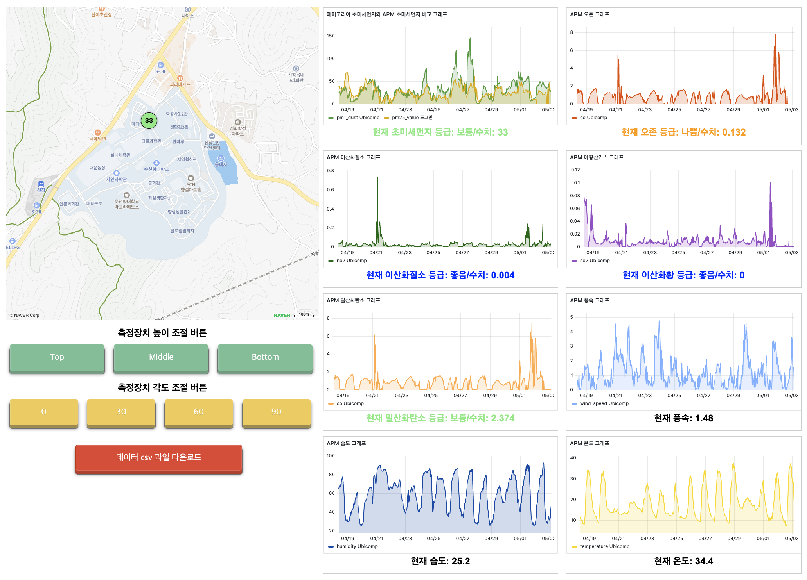
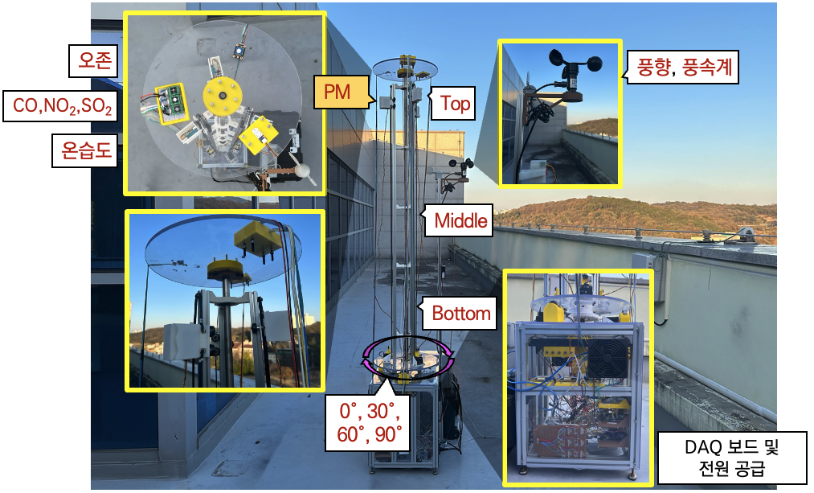

# 🌍 APM_Viz - 웹 기반 미세먼지 측정 장치 컨트롤 및 시각화

> **REST API를 통해 미세먼지 측정 장치를 컨트롤하고, InfluxDB & Grafana를 활용하여 데이터를 시각화하는 프로젝트**  
> 미세먼지 측정 장치의 실시간 데이터를 저장 및 분석하며, AirKorea API를 이용하여 공공 데이터와 비교 분석합니다.

---

## 📸 프로젝트 미리보기
### **1️⃣ 실시간 미세먼지 시각화 웹 페이지**

### **2️⃣ 미세먼지 측정 장치 및 구성 요소**

---

## 📖 목차
- [📌 프로젝트 소개](#-프로젝트-소개)
- [🔍 주요 기능](#-주요-기능)
- [📦 기술 스택](#-기술-스택)
---

## 📌 프로젝트 소개
이 프로젝트는 **미세먼지 측정 장치를 제어**하고, **실시간 데이터를 수집 및 분석**하는 웹 애플리케이션입니다.

💡 **주요 목표**:
- REST API를 이용하여 **미세먼지 측정 장치 컨트롤**
- Mobius를 통해 **실시간 센서 데이터 수집**
- **InfluxDB & Grafana**를 활용한 데이터 저장 및 시각화
- AirKorea API 데이터를 비교하여 **공공 데이터와 실측 데이터를 비교 분석**

---

## 🔍 주요 기능
✅ **미세먼지 측정 장치의 REST API 컨트롤**  
✅ **Mobius를 통해 센서 데이터 수집**  
✅ **InfluxDB에 실시간 데이터 저장**  
✅ **Grafana 대시보드를 통한 시각적 분석**  
✅ **AirKorea API 데이터를 활용한 비교 분석**  
---

## 📦 기술 스택
### **🔗 Backend**
- **Java Spring** - 서버
- **Mobius** - IoT 데이터 관리 (OneM2M 기반)
- **InfluxDB** - 실시간 데이터 저장
- **MySQL** - 관계형 데이터 저장

### **💻 Frontend**
- **HTML / CSS / JavaScript**
- **Grafana** - 데이터 시각화

### **☁️ API & 데이터**
- **에어코리아 OPEN API** - 공공 미세먼지 데이터 수집
- **REST API (미세먼지 측정 장치 컨트롤)**
